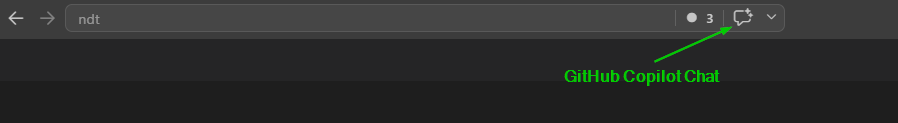
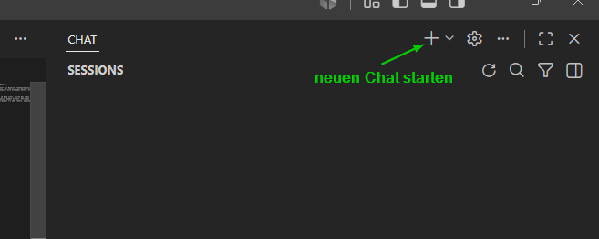
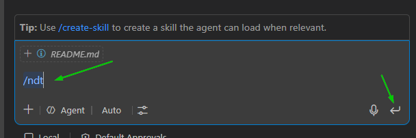
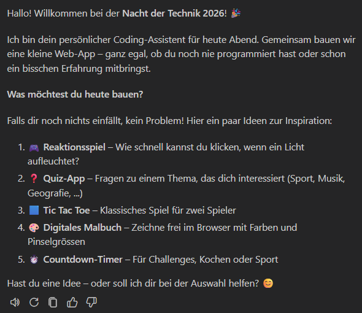

# Nacht der Technik 2026 @Microsoft - GitHub Copilot
Willkommen zur Nacht der Technik 2026 bei der Microsoft Deutschland GmbH in Köln! 🎉

In dieser spannenden Session unter dem Motto "Democratizing Software Development" (zu Deutsch: "Softwareentwicklung für alle zugänglich machen") wirst du die Gelegenheit haben, mit GitHub Copilot ✈️ zu experimentieren und deine eigenen kleinen Web-Applikationen zu erstellen. Du hast noch nie programmiert? Kein Problem! Copilot wird dir dabei helfen, Schritt für Schritt deine Ideen 💡 in Code umzusetzen. 🚀 Nach einer kurzen Einführung in GitHub Copilot legst Du auch schon selbst los.

### Bereit? - Dann folge diesen Schritten

1. Öffne **Visual Studio Code (VS Code)** auf deinem Laptop. 💻 - Wenn Du vor Ort im Raum sitzt, sollte das schon jemand für Dich gemacht haben 😉
2. Öffne das **GitHub Copilot Chat Panel**, indem Du oben mittig auf das GitHub Copilot Symbol klickst. Falls das Panel schon offen ist, ist alles okay. ✅  
     

3. Sollte im Chat Panel noch ein alter Chat sichtbar sein, klicke auf das Plus-Symbol (+) oben rechts, um einen **neuen Chat** zu starten. 🆕  
     

4. Klicke in das Chatfenster ganz unten und tippe `/ndt` (für Nacht der Technik) ein und drücke `Enter`.  
     

5. Jetzt geht's los! 🚀 Befolge die Anweisungen von Copilot, stelle ihm Fragen, gib ihm Ideen. Es ist **Deine** Applikation - mach' was draus! 💪  
   

Du bist vor Ort im Raum und hast Fragen, Wünsche oder hängst fest? Wir sind für Dich da! Sprich uns einfach an. 😊 Oder noch besser: zeig uns, was Du cooles gebaut hast! 🤩